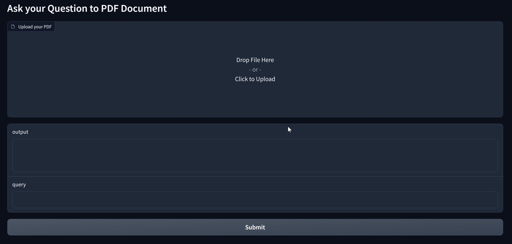

# Document Interaction with AI
## Project Overview
Welcome everyone, This project combines AI and document analysis to make interacting with PDFs even better.A user-friendly connection with Large Language Models (LLMs). I've utilized tools like Langchain, LLM, Gardio, and FAISS to simplify the process of asking and answering questions about PDFs. The repository contains a complete application that makes PDF question and answering a breeze.


## Key Features

### Easy PDF Interaction

Gone are the days of reading through entire documents. With this you can effortlessly upload your PDFs and perform a multitude of tasks without the need to go through the entire document.

### Quick Q&A

This project enables you to pose questions as if you're conversing with a person. The system intelligently extracts the right answers from your PDFs, eliminating the need for manual searches through lengthy documents.

Note : If you utilize a quantized LLAMA model, the outcomes might contrast when compared to results achieved using `FP16` or `FP32` models. When working with Colab, you have the option to employ `load_int8:true` in the configuration file.

You can try using colab notebook : <a target="_blank" href="https://colab.research.google.com/drive/1KT1McE-o0DPxw_4VYKgvYEGQBInkMtuQ?usp=sharing">
  
</a>



### Embedding Loading

Upon uploading a PDF, the project generates document embeddings, enhancing the efficiency of search and analysis. These embeddings are stored locally, ensuring rapid access whenever needed.

## Project Components

- **Model**: LLama2-7B
- **Framework**: Langchain
- **Frontend**: Gradio
- **Sentence Embeddings**: thenlper/gte-large
- **PDF Loader**: PyPDFLoader


## Getting Started

To start using this project, follow these steps:

1. Clone the repository to your local machine.
2. Install the required dependencies,using  ```pip install -r requirements```.
3. Run the ```python app.py``` application and begin interacting with your PDFs using natural language.

---

*Note:You have the flexibility to select different sentence embeddings and LLM models by just changing configure file.
